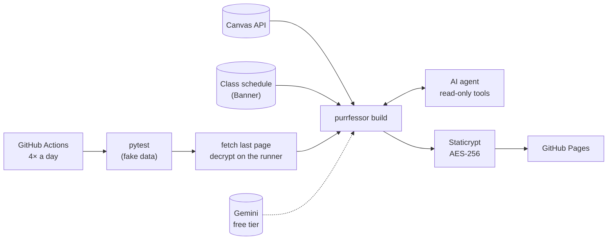
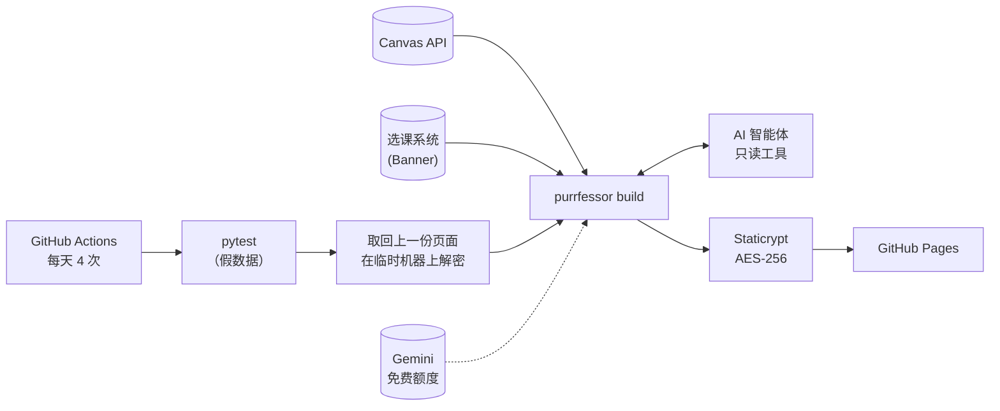

<p align="center">
  
</p>

<h1 align="center">Purrfessor · 喵教授</h1>

<p align="center">
  <b>Your Canvas, one page a day — with a self-improving AI agent. Free, private, runs in the cloud.</b><br>
  <b>每天一页，Canvas 上要做的事一目了然；自改进 AI 智能体帮你排优先级。免费、加密、跑在云端。</b>
</p>

<p align="center">
  <a href="#english">English</a> · <a href="#中文">中文</a> ·
  <a href="LICENSE">MIT License</a>
</p>

---

## English

Purrfessor reads your **Canvas** four times a day and publishes one **password-protected** page to GitHub Pages.
It shows what to attend, what is due, and what changed since the last update. You never have to open Canvas just
to find out what you forgot. It runs entirely on **GitHub Actions**: no server, and nothing runs on your computer.

It works for **any school that uses Canvas**. **UC Riverside** is the first built-in preset, and more presets are welcome.

<p align="center"><br>
<sub>Demo with made-up courses.</sub></p>

### What's on the page

| | |
|---|---|
| **Today** | Today's and tomorrow's classes, with live countdowns to the next class and the next deadline |
| **To-do** | Everything due in the next two weeks, grouped by day. Overdue and just-submitted work is shown separately. Weekly tasks outside Canvas (Top Hat, homework sites…) have a checkbox you tick yourself |
| **Timetable** | A full-term calendar ([FullCalendar](https://fullcalendar.io)). Class times, rooms and instructors come from the school's class schedule, and each day's deadlines sit in the top row |
| **Announcements** | Recent announcements. Deadlines mentioned in them ("survey due next Friday") become to-dos |
| **Grades** | The grade per course (when the instructor shows it), a points rate from graded work, and missing and late counts |
| **Today's brief** | An AI agent picks what to do first and why, with a concrete first step. It checks whether yesterday's advice was followed and learns from it |
| **Since last update** | New assignments, submissions, moved deadlines, withdrawn work, new announcements and timetable changes. A snapshot is kept every day for 30 days |
| **The wizard cat** | *"Tip: in 2026, you've wasted 38 weeks"*: whole weeks since January 1, live 🐱 |

**Language:** set `language = "en"` or `"zh"`. The Chinese UI translates English Canvas content (titles,
announcement summaries) with Gemini. The English UI has nothing to translate. The cat's caption follows the language.

### Quick start (about 10 minutes)

You need a GitHub account, Python 3.11 or newer, and the [GitHub CLI](https://cli.github.com) (`gh auth login`).

1. Click **Use this template → Create a new repository**. Make it **public**, because GitHub Pages is free only for
   public repositories. Your page is still encrypted.
2. Clone it and install:
   ```bash
   git clone https://github.com/<you>/<repo> && cd <repo>
   python3 -m venv .venv && . .venv/bin/activate && pip install -e .
   ```
3. Run the setup and answer its questions:
   ```bash
   purrfessor init
   ```
   It asks for:
   - your school preset, language and name;
   - a **Canvas token**, which it checks against Canvas (Canvas → Account → Settings → *New Access Token*);
   - a **site password**;
   - optionally, a free **Gemini API key** from [aistudio.google.com/apikey](https://aistudio.google.com/apikey).

   It then stores everything as encrypted GitHub Secrets, turns on GitHub Pages and starts the first deploy.
4. About 3 minutes later, open `https://<you>.github.io/<repo>/`, enter your password and tick *remember me*.

To change something later (course names, extra classes, weekly tasks), edit `purrfessor.toml` and run
`purrfessor config-upload`. Every option is explained in
[`purrfessor.example.toml`](purrfessor/templates/purrfessor.example.toml).

| Secret / variable | | |
|---|---|---|
| `CANVAS_TOKEN` | required | Reads your Canvas (read-only use) |
| `SITE_PASSWORD` | required | Unlocks the page |
| `PURRFESSOR_CONFIG` | required | Your `purrfessor.toml` (never committed) |
| `GEMINI_API_KEY` | optional | Translation, announcement reading, today's brief |
| `PURRFESSOR_ENABLED` (variable) | required | `true` turns on the deploy workflow |

### Your own pages, and moving an existing site over

- **Other pages.** Files in a `site/` folder in your repo are published as they are, next to the dashboard.
  To keep your own home page at the site root, move the dashboard into a subfolder in `purrfessor.toml`:
  ```toml
  [site]
  path = "today"   # the dashboard is at https://<you>.github.io/<repo>/today/
  home = true      # adds a "Home" link back to the site root
  ```
- **Already have a Staticrypt site?** Commit its `.staticrypt.json`. Its salt is then used instead of the per-repo
  one, so "remember me" keeps working, and the first run can still decrypt your last page and carry on from it.
- **Running `purrfessor init` again** keeps the secrets you already set: press Enter at each one.

### Privacy and cost

- **Free.** Public repositories get unlimited GitHub Actions minutes. Four runs a day take about 3 minutes each.
  Gemini's free tier is enough.
- **Encrypted.** The page is encrypted with [Staticrypt](https://github.com/robinmoisson/staticrypt) (AES-256) and
  decrypted in your browser. The URL is public, but the content is unreadable without the password.
- **Nothing personal in the repo.** Your token, password and config live in GitHub Secrets. Workflow logs contain
  only counts, never titles or text. Snapshots are stored inside the encrypted page itself: no database and no commits.
- **Gemini.** With a key, assignment titles and announcement text are sent to Google's Gemini API. The free tier's
  data may be used by Google to improve its products. Leave the key out and everything else still works, with
  rule-based deadline reading instead.

### How it works



Failing tests block the deploy, so the live page keeps the last good version. When Canvas, the class schedule or
Gemini is down, the page is still built and shows the reason at the top.

### The AI agent

Built with [PydanticAI](https://ai.pydantic.dev) on Gemini's free tier, following the usual practice for
agents that act on your data:

- **Code computes the facts.** States, countdowns, overdue work and changes all come from code. The agent only
  ranks and explains.
- **Read-only tools.** It can use 7 tools that list tasks, the schedule, changes, task details, grades,
  announcements and feedback. It has no tool that writes anything.
- **Typed, validated output.** An unknown task id triggers a retry. Text lengths are capped.
- **Hard limits.** At most 7 requests and 14 tool calls. Across models it falls back from
  `gemini-3.5-flash-lite` to `gemini-3.6-flash` to `gemini-flash-latest`.
- **Fail-safe.** If anything goes wrong, the brief is hidden and the rest of the page is unaffected.
- **Announcements are trusted.** They are official information from instructors and override Canvas when they
  are newer.
- **Self-improving.** On the next run, code checks each suggestion: *done*, *missed*, *not due yet* or
  *can't check*. The agent reads that record and keeps at most 5 lessons about your habits. Its memory travels
  in the encrypted snapshot.

### Add your school

Create `purrfessor/presets/<school>.toml`, using [`ucr.toml`](purrfessor/presets/ucr.toml) as the example:

- `[school]` needs a name, the Canvas URL and a time zone.
- If your school uses **Ellucian Banner 9**, add `[banner]` for automatic class times, rooms and instructors.
  The public class search URL ends in `/StudentRegistrationSsb/ssb`. The preset also needs a regex that parses
  Canvas section codes, plus the term codes.
- Add the holidays.

Without Banner, list your classes under `[[classes]]` in your config. Pull requests with new presets are very welcome.

### Development

```bash
mise run setup && mise run test      # or: pip install -e '.[test]' && pytest
```

The tests use a fake Canvas, a fake Banner and a scripted model (`FunctionModel`). They step through time to
cover the task state machine, page invariants, time-zone and DST edge cases, both languages, every agent
guardrail and the self-improvement loop, plus a headless-Chrome smoke test. Dependabot proposes upgrades weekly,
and tests run on every PR.

### Limits

- Canvas tokens expire according to your school's policy. When that happens the page says so: create a new
  token and run `gh secret set CANVAS_TOKEN`.
- GitHub may delay scheduled runs at busy times. The cron times are UTC, so adjust them for your time zone in
  `.github/workflows/deploy.yml`.
- Many instructors hide course totals. The grades card then shows the points rate of graded work instead.
- Purrfessor isn't affiliated with Instructure, Ellucian, Google or any university.

### Credits

[Tabler](https://tabler.io) · [FullCalendar](https://fullcalendar.io) ·
[Staticrypt](https://github.com/robinmoisson/staticrypt) · [PydanticAI](https://ai.pydantic.dev) ·
[google-genai](https://github.com/googleapis/python-genai) ·
[gh-workflow-keepalive](https://github.com/liskin/gh-workflow-keepalive).

The code is MIT-licensed. The wizard-cat picture (`purrfessor/assets/cat.jpg`) is a widely shared internet meme
and isn't covered by the MIT license. Replace it or turn it off with `meme = false` if you prefer.

---

## 中文

喵教授每天 4 次读取你的 **Canvas**，生成一页**加密**网页，发布在 GitHub Pages 上。页面上有：今天上什么课、
什么作业快到期、和上次比有什么变化。再也不用为了"我是不是漏了什么"去翻 Canvas。全部跑在 **GitHub Actions**
上，不需要服务器，也不需要开着自己的电脑。

它适用于**所有使用 Canvas 的学校**。**UC Riverside（UCR）** 是第一个内置的学校预设，欢迎补充更多学校。

<p align="center"><br>
<sub>演示数据，课程均为虚构。</sub></p>

### 页面上有什么

| | |
|---|---|
| **今天** | 今天和明天的课；离下一节课、下一个截止还有多久（实时倒计时） |
| **待办** | 两周内要交的作业按天分组，逾期和刚交掉的单独列出；Canvas 之外每周固定的任务（Top Hat、网上作业系统等）自己打勾 |
| **课程表** | 整个学期的日历（[FullCalendar](https://fullcalendar.io)）。上课时间、教室、老师从学校选课系统读取，每天最上面一行是当天的截止 |
| **公告** | 最近的公告；公告里提到的截止（如"下周五前填问卷"）会自动变成待办 |
| **成绩** | 每门课的总成绩（老师公开时）、已批改作业的得分率，以及缺交、晚交数量 |
| **今日简报** | AI 智能体告诉你今天先做什么、为什么，以及第一步做什么；它还会核对昨天的建议有没有被执行，并从中总结经验 |
| **和上次比** | 新作业、刚交的、截止改了的、被撤下的、新公告、课表变化；每天存一份快照，保留 30 天 |
| **巫师猫** | "小提示：你已经在 2026 浪费了 38 个星期了"——从 1 月 1 日算起的整周数，实时更新 🐱 |

**语言：** 在配置里写 `language = "zh"` 或 `"en"`。中文界面会用 Gemini 把 Canvas 上的英文内容（作业标题、
公告摘要）翻译成中文；英文界面不需要翻译。猫猫表情包的配文也跟着语言变。

### 快速开始（约 10 分钟）

需要一个 GitHub 账号、Python 3.11 或更新版本，并安装 [GitHub CLI](https://cli.github.com)，然后运行 `gh auth login` 登录。

1. 点击 **Use this template → Create a new repository**，选 **Public**（免费账号只有公开仓库能用 GitHub Pages；
   页面本身是加密的）。
2. 克隆并安装：
   ```bash
   git clone https://github.com/<你>/<仓库> && cd <仓库>
   python3 -m venv .venv && . .venv/bin/activate && pip install -e .
   ```
3. 运行配置向导，按提示回答：
   ```bash
   purrfessor init
   ```
   它会问你：
   - 学校预设、语言和名字；
   - **Canvas token**，会当场验证是否可用（Canvas → Account → Settings → *New Access Token*）；
   - **网站口令**；
   - 可选的免费 **Gemini API key**（[aistudio.google.com/apikey](https://aistudio.google.com/apikey)）。

   然后它会把这些存成加密的 GitHub Secrets，开启 GitHub Pages，并触发第一次部署。
4. 大约 3 分钟后打开 `https://<你>.github.io/<仓库>/`，输入口令，勾选"30 天内记住我"。

以后要修改（课程简称、额外的课、每周固定任务），编辑 `purrfessor.toml`，然后运行 `purrfessor config-upload`。
所有选项都在 [`purrfessor.example.toml`](purrfessor/templates/purrfessor.example.toml) 里有中英文说明。

| Secret / 变量 | | |
|---|---|---|
| `CANVAS_TOKEN` | 必需 | 读取你的 Canvas（只读使用） |
| `SITE_PASSWORD` | 必需 | 网页口令 |
| `PURRFESSOR_CONFIG` | 必需 | 你的 `purrfessor.toml`（不进仓库） |
| `GEMINI_API_KEY` | 可选 | 翻译、理解公告、今日简报 |
| `PURRFESSOR_ENABLED`（变量） | 必需 | 设为 `true` 才会部署 |

### 自己的页面，以及迁移已有网站

- **其他页面。** 仓库里 `site/` 目录下的文件会原样发布，和今日页面放在一起。想在网站根目录保留自己的主页，
  就在 `purrfessor.toml` 里把今日页面放进子目录：
  ```toml
  [site]
  path = "today"   # 今日页面在 https://<你>.github.io/<仓库>/today/
  home = true      # 顶部加一个回到网站首页的链接
  ```
- **已经有用 Staticrypt 加密的网站？** 把它的 `.staticrypt.json` 提交到仓库，就会沿用里面的盐：
  "记住我"继续有效，第一次运行也能解密上一份页面，接着往下比较和记忆。
- **再次运行 `purrfessor init`** 时，已经设置过的 secret 直接回车就会保留。

### 隐私与费用

- **免费。** 公开仓库的 GitHub Actions 分钟数不限；每天 4 次，每次约 3 分钟。Gemini 免费额度就够用。
- **加密。** 页面用 [Staticrypt](https://github.com/robinmoisson/staticrypt)（AES-256）加密，在浏览器里解密。
  网址是公开的，但没有口令什么也看不到。
- **仓库里没有任何个人信息。** token、口令、配置都存在 GitHub Secrets；运行日志只记数量，不记标题和内容。
  快照就存在加密页面本身里：没有数据库，也不产生提交。
- **关于 Gemini。** 配置了 key 后，作业标题和公告内容会发送到 Google 的 Gemini API；免费版的数据可能被 Google
  用来改进产品。不配置 key 时其他功能照常，截止日期改用规则识别。

### 工作原理



测试不通过就不部署，线上保留上一个正常的版本。Canvas、选课系统或 Gemini 出问题时，页面照常生成，并在顶部说明原因。

### AI 智能体

用 [PydanticAI](https://ai.pydantic.dev) 搭建，模型用 Gemini 免费版，遵循处理个人数据时的业界通行做法：

- **事实由代码计算。** 作业状态、倒计时、是否逾期、有什么变化，都由代码算出；智能体只负责排序和解释。
- **只读工具。** 共 7 个工具：列出作业、课表、变化、作业详情、成绩、公告和执行反馈；没有任何能写入的工具。
- **输出有类型、有校验。** 引用了不存在的作业 id 会被要求重试；文字长度有上限。
- **硬性上限。** 最多 7 次请求、14 次工具调用；模型按 `gemini-3.5-flash-lite` → `gemini-3.6-flash` →
  `gemini-flash-latest` 依次回退。
- **失败不影响页面。** 出任何问题都只是不显示简报，页面其他部分不受影响。
- **公告是可信信息。** 公告是老师发布的正式信息，比 Canvas 更新时以公告为准。
- **自改进。** 下次运行时，代码逐条核对上次的建议：已交、错过、还没到期、看不到完成情况。智能体读取这些结果，
  维护最多 5 条关于你习惯的经验；它的记忆存在加密快照里，一代代传下去。

### 添加你的学校

参照 [`ucr.toml`](purrfessor/presets/ucr.toml)，新建 `purrfessor/presets/<学校>.toml`：

- `[school]` 写学校名称、Canvas 网址和时区。
- 如果学校用 **Ellucian Banner 9**，再加 `[banner]`，就能自动读取上课时间、教室和老师。公开选课查询的网址以
  `/StudentRegistrationSsb/ssb` 结尾；预设里还需要一个解析 Canvas 班号的正则，以及学期代码。
- 写上校历假期。

没有 Banner 的学校，在配置里用 `[[classes]]` 手动填课表。非常欢迎提交新学校预设的 PR。

### 开发

```bash
mise run setup && mise run test      # 或者：pip install -e '.[test]' && pytest
```

测试使用假 Canvas、假选课系统和脚本化的模型（`FunctionModel`），通过"时间快进"覆盖：作业状态机、页面不变量、
时区和夏令时边界、中英两种语言、智能体的每一条护栏、自改进闭环，以及无头 Chrome 冒烟测试。Dependabot
每周提出依赖升级，每个 PR 都会先跑测试。

### 已知限制

- Canvas token 会按学校的规定过期。过期后页面会提示：生成新 token，然后运行 `gh secret set CANVAS_TOKEN`。
- GitHub 在高峰时段可能推迟定时任务。cron 用的是 UTC 时间，别的时区请修改 `.github/workflows/deploy.yml`。
- 很多老师不公开总成绩。这时成绩卡片显示已批改作业的得分率。
- 本项目与 Instructure、Ellucian、Google 及任何大学无关。

### 致谢

[Tabler](https://tabler.io) · [FullCalendar](https://fullcalendar.io) ·
[Staticrypt](https://github.com/robinmoisson/staticrypt) · [PydanticAI](https://ai.pydantic.dev) ·
[google-genai](https://github.com/googleapis/python-genai) ·
[gh-workflow-keepalive](https://github.com/liskin/gh-workflow-keepalive)。

代码使用 MIT 协议。巫师猫图片（`purrfessor/assets/cat.jpg`）是网络上广泛流传的表情包，不在 MIT 协议范围内；
介意的话可以替换，或者用 `meme = false` 关掉。
