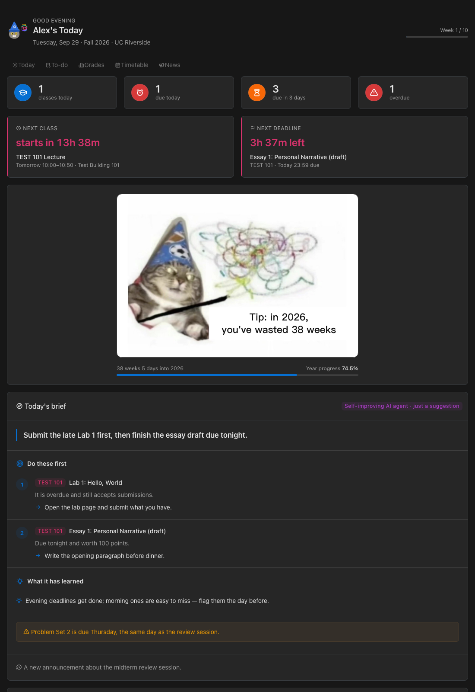
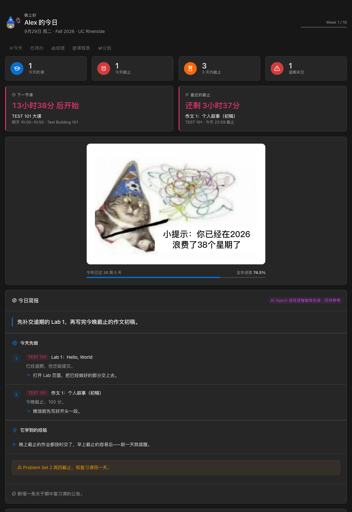
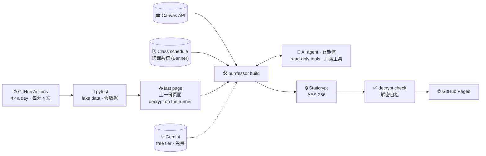
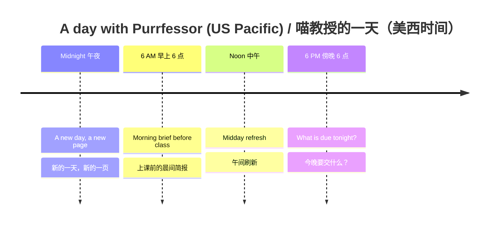

<a id="top"></a>

<picture>
  <source media="(prefers-color-scheme: dark)" srcset="docs/banner-dark.svg">
  
</picture>

<p align="center">
  <a href="https://github.com/ShepherdLoveYou/purrfessor/actions/workflows/test.yml"></a>
  <a href="pyproject.toml"></a>
  <a href="LICENSE"></a>
  <a href="https://github.com/ShepherdLoveYou/purrfessor/commits/main"></a>
  <a href="https://github.com/ShepherdLoveYou/purrfessor/stargazers"></a>
  <br>
  
  
  
  <a href="https://ai.pydantic.dev"></a>
  
  
  
  
  
</p>

<p align="center">
  <a href="https://github.com/ShepherdLoveYou/purrfessor/generate"></a>
</p>

**Purrfessor** reads your **Canvas** four times a day and publishes one **password-protected** page to GitHub Pages:
what to attend, what is due, and what changed since the last update. You never have to open Canvas just to find
out what you forgot.

**喵教授**每天 4 次读取你的 **Canvas**，在 GitHub Pages 上发布一页**加密**网页：今天上什么课、什么作业快到期、
和上次比有什么变化。再也不用为了"我是不是漏了什么"去翻 Canvas。

It runs entirely on **GitHub Actions**: no server, and nothing runs on your computer. It works for **any school
that uses Canvas**, and **UC Riverside** is the first built-in preset.

全部跑在 **GitHub Actions** 上：不需要服务器，也不用开着自己的电脑。**所有使用 Canvas 的学校**都能用，
**UC Riverside（UCR）** 是第一个内置的学校预设。

> [!TIP]
> Set `language = "zh"` and English Canvas content (titles, announcement summaries) is translated with Gemini;
> `language = "en"` needs no translation. The wizard cat's caption follows the language.<br>
> 配置 `language = "zh"`，Canvas 上的英文内容（作业标题、公告摘要）会用 Gemini 翻译成中文；
> `language = "en"` 则不翻译。巫师猫的配文也跟着语言变。

<table>
  <tr>
    <th>English</th>
    <th>中文</th>
  </tr>
  <tr>
    <td></td>
    <td></td>
  </tr>
</table>
<p align="center"><sub>Demo with made-up courses. / 演示数据，课程均为虚构。</sub></p>

---

## ✨ What's on the page / 页面上有什么

| | |
|---|---|
| ☀️ **Today · 今天** | Today's and tomorrow's classes, with live countdowns to the next class and the next deadline.<br>今天和明天的课；离下一节课、下一个截止还有多久（实时倒计时）。 |
| ✅ **To-do · 待办** | Everything due in the next two weeks, grouped by day; overdue and just-submitted work shown separately. Weekly tasks outside Canvas (Top Hat, homework sites…) get a checkbox you tick yourself.<br>两周内要交的作业按天分组，逾期和刚交掉的单独列出；Canvas 之外每周固定的任务（Top Hat、网上作业系统等）自己打勾。 |
| 🗓️ **Timetable · 课程表** | A full-term calendar. Class times, rooms and instructors come from the school's class schedule; each day's deadlines sit in the top row.<br>整个学期的日历。上课时间、教室、老师从学校选课系统读取，每天最上面一行是当天的截止。 |
| 📣 **Announcements · 公告** | Recent announcements. Deadlines mentioned in them ("survey due next Friday") become to-dos.<br>最近的公告；公告里提到的截止（如"下周五前填问卷"）会自动变成待办。 |
| 📊 **Grades · 成绩** | The grade per course (when the instructor shows it), a points rate from graded work, missing and late counts.<br>每门课的总成绩（老师公开时）、已批改作业的得分率，以及缺交、晚交数量。 |
| 🧠 **Today's brief · 今日简报** | An AI agent picks what to do first and why, with a concrete first step. It checks whether yesterday's advice was followed and learns from it.<br>AI 智能体告诉你今天先做什么、为什么、第一步做什么；它还会核对昨天的建议有没有被执行，并从中总结经验。 |
| 🔁 **Since last update · 和上次比** | New assignments, submissions, moved deadlines, withdrawn work, new announcements, timetable changes. One snapshot a day is kept for 30 days.<br>新作业、刚交的、截止改了的、被撤下的、新公告、课表变化；每天存一份快照，保留 30 天。 |
| 🧙 **The wizard cat · 巫师猫** | *"Tip: in 2026, you've wasted 38 weeks"*: whole weeks since January 1, live.<br>"小提示：你已经在 2026 浪费了 38 个星期了"——从 1 月 1 日算起的整周数，实时更新。 |

---

<a id="quick-start"></a>

## 🚀 Quick start / 快速开始

About 10 minutes. You need a GitHub account, Python 3.11 or newer, and the [GitHub CLI](https://cli.github.com)
(`gh auth login`).

大约 10 分钟。需要一个 GitHub 账号、Python 3.11 或更新版本，并安装 [GitHub CLI](https://cli.github.com)
（运行 `gh auth login` 登录）。

1. Click **[Use this template](https://github.com/ShepherdLoveYou/purrfessor/generate) → Create a new repository**
   and make it **public**: GitHub Pages is free only for public repositories, and your page is still encrypted.<br>
   点击 **Use this template → Create a new repository**，选 **Public**：免费账号只有公开仓库能用 GitHub Pages，
   页面本身是加密的。
2. Clone it and install. / 克隆并安装：
   ```bash
   git clone https://github.com/<you>/<repo> && cd <repo>
   python3 -m venv .venv && . .venv/bin/activate && pip install -e .
   ```
3. Run the setup and answer its questions. / 运行配置向导，按提示回答：
   ```bash
   purrfessor init
   ```
   

   - School preset, language and name. / 学校预设、语言和名字。
   - A **Canvas token**, checked against Canvas right away (Canvas → Account → Settings → *New Access Token*).<br>
     **Canvas token**，会当场验证是否可用。
   - A **site password**. / **网站口令**。
   - Optionally, a free **Gemini API key** from [aistudio.google.com/apikey](https://aistudio.google.com/apikey).<br>
     可选的免费 **Gemini API key**。

   It stores everything as encrypted GitHub Secrets, turns on GitHub Pages and starts the first deploy.<br>
   它会把这些存成加密的 GitHub Secrets，开启 GitHub Pages，并触发第一次部署。
4. About 3 minutes later, open `https://<you>.github.io/<repo>/`, enter your password and tick *remember me*.<br>
   大约 3 分钟后打开 `https://<你>.github.io/<仓库>/`，输入口令，勾选"30 天内记住我"。

> [!NOTE]
> To change something later (course names, extra classes, weekly tasks), edit `purrfessor.toml` and run
> `purrfessor config-upload`. Every option is explained in [`purrfessor.example.toml`](purrfessor/templates/purrfessor.example.toml).<br>
> 以后要修改（课程简称、额外的课、每周固定任务），编辑 `purrfessor.toml`，然后运行 `purrfessor config-upload`。
> 所有选项都在 [`purrfessor.example.toml`](purrfessor/templates/purrfessor.example.toml) 里有中英文说明。

| Secret / variable | | What it's for | 用途 |
|---|---|---|---|
| `CANVAS_TOKEN` | required / 必需 | Reads your Canvas (read-only use) | 读取你的 Canvas（只读使用） |
| `SITE_PASSWORD` | required / 必需 | Unlocks the page | 网页口令 |
| `PURRFESSOR_CONFIG` | required / 必需 | Your `purrfessor.toml`, never committed | 你的 `purrfessor.toml`，不进仓库 |
| `GEMINI_API_KEY` | optional / 可选 | Translation, announcement reading, today's brief | 翻译、理解公告、今日简报 |
| `PURRFESSOR_ENABLED` (variable / 变量) | required / 必需 | `true` turns on the deploy workflow | 设为 `true` 才会部署 |

<details>
<summary><b>Your own pages, and moving an existing site over / 自己的页面，以及迁移已有网站</b></summary>
<br>

- **Other pages.** Files in a `site/` folder in your repo are published as they are, next to the dashboard. To keep
  your own home page at the site root, move the dashboard into a subfolder:<br>
  **其他页面。** 仓库里 `site/` 目录下的文件会原样发布，和今日页面放在一起。想在网站根目录保留自己的主页，
  就把今日页面放进子目录：
  ```toml
  [site]
  path = "today"   # https://<you>.github.io/<repo>/today/
  home = true      # a "Home" link back to the site root / 顶部加一个回到网站首页的链接
  ```
- **Already have a Staticrypt site?** Commit its `.staticrypt.json`. Its salt is then used instead of the per-repo
  one, so "remember me" keeps working and the first run can still decrypt your last page and carry on from it.<br>
  **已经有用 Staticrypt 加密的网站？** 把它的 `.staticrypt.json` 提交到仓库，就会沿用里面的盐："记住我"继续有效，
  第一次运行也能解密上一份页面，接着往下比较和记忆。
- **Running `purrfessor init` again** keeps the secrets you already set: press Enter at each one.<br>
  **再次运行 `purrfessor init`** 时，已经设置过的 secret 直接回车就会保留。
- **Framework updates.** `git remote add upstream https://github.com/ShepherdLoveYou/purrfessor.git`, then
  `git pull --no-rebase upstream main`. `init` always works on your `origin` repo, never on the template.<br>
  **更新框架。** 添加 upstream 远程后运行 `git pull --no-rebase upstream main`。`init` 只会操作你自己的 `origin` 仓库，不会动模板。

</details>

---

## 🔒 Privacy and cost / 隐私与费用

- **Free.** Public repositories get unlimited GitHub Actions minutes; four runs a day take about 3 minutes each.
  Gemini's free tier is enough.<br>
  **免费。** 公开仓库的 GitHub Actions 分钟数不限；每天 4 次，每次约 3 分钟。Gemini 免费额度就够用。
- **Encrypted.** The page is encrypted with [Staticrypt](https://github.com/robinmoisson/staticrypt) (AES-256) and
  decrypted in your browser. The URL is public, but the content is unreadable without the password. Before each
  deploy, the workflow checks that the page decrypts back to exactly what was built.<br>
  **加密。** 页面用 [Staticrypt](https://github.com/robinmoisson/staticrypt)（AES-256）加密，在浏览器里解密。
  网址是公开的，但没有口令什么也看不到。每次发布前，工作流都会验证页面能用口令解密回原样。
- **Nothing personal in the repo.** Your token, password and config live in GitHub Secrets. Workflow logs contain
  only counts, never titles or text. Snapshots live inside the encrypted page itself: no database, no commits.<br>
  **仓库里没有任何个人信息。** token、口令、配置都存在 GitHub Secrets；运行日志只记数量，不记标题和内容。
  快照就存在加密页面本身里：没有数据库，也不产生提交。

> [!IMPORTANT]
> With a Gemini key, assignment titles and announcement text are sent to Google's Gemini API, and the free tier's
> data may be used by Google to improve its products. Leave the key out and everything else still works, with
> rule-based deadline reading instead.<br>
> 配置了 Gemini key 后，作业标题和公告内容会发送到 Google 的 Gemini API；免费版的数据可能被 Google 用来改进产品。
> 不配置 key 时其他功能照常，截止日期改用规则识别。

---

## ⚙️ How it works / 工作原理





Failing tests block the deploy, so the live page keeps the last good version. When Canvas, the class schedule or
Gemini is down, the page is still built and shows the reason at the top.

测试不通过就不部署，线上保留上一个正常的版本。Canvas、选课系统或 Gemini 出问题时，页面照常生成，并在顶部说明原因。

---

## 🧠 The AI agent / AI 智能体

Built with [PydanticAI](https://ai.pydantic.dev) on Gemini's free tier, following the usual practice for agents
that act on your data.

用 [PydanticAI](https://ai.pydantic.dev) 搭建，模型用 Gemini 免费版，遵循处理个人数据时的业界通行做法。

- **Code computes the facts.** States, countdowns, overdue work and changes all come from code; the agent only
  ranks and explains.<br>
  **事实由代码计算。** 作业状态、倒计时、是否逾期、有什么变化都由代码算出；智能体只负责排序和解释。
- **Read-only tools.** 7 tools list tasks, the schedule, changes, task details, grades, announcements and feedback.
  None of them writes anything.<br>
  **只读工具。** 共 7 个工具：作业、课表、变化、作业详情、成绩、公告和执行反馈；没有任何能写入的工具。
- **Typed, validated output.** An unknown task id triggers a retry; text lengths are capped.<br>
  **输出有类型、有校验。** 引用不存在的作业 id 会被要求重试；文字长度有上限。
- **Hard limits.** At most 7 requests and 14 tool calls, falling back from `gemini-3.5-flash-lite` to
  `gemini-3.6-flash` to `gemini-flash-latest`.<br>
  **硬性上限。** 最多 7 次请求、14 次工具调用；模型按 `gemini-3.5-flash-lite` → `gemini-3.6-flash` →
  `gemini-flash-latest` 依次回退。
- **Fail-safe.** If anything goes wrong, the brief is hidden and the rest of the page is unaffected.<br>
  **失败不影响页面。** 出任何问题都只是不显示简报，页面其他部分不受影响。
- **Announcements are trusted.** They are official information from instructors and override Canvas when newer.<br>
  **公告是可信信息。** 公告是老师发布的正式信息，比 Canvas 更新时以公告为准。
- **Self-improving.** On the next run, code checks each suggestion (*done*, *missed*, *not due yet*, *can't check*).
  The agent reads that record and keeps at most 5 lessons about your habits; its memory travels in the encrypted
  snapshot.<br>
  **自改进。** 下次运行时，代码逐条核对上次的建议（已交、错过、还没到期、看不到）。智能体读取这些结果，
  维护最多 5 条关于你习惯的经验；它的记忆存在加密快照里，一代代传下去。

---

## 🏫 Add your school / 添加你的学校

Create `purrfessor/presets/<school>.toml`, using [`ucr.toml`](purrfessor/presets/ucr.toml) as the example.

参照 [`ucr.toml`](purrfessor/presets/ucr.toml)，新建 `purrfessor/presets/<学校>.toml`。

- `[school]` needs a name, the Canvas URL and a time zone.<br>
  `[school]` 写学校名称、Canvas 网址和时区。
- If your school uses **Ellucian Banner 9**, add `[banner]` for automatic class times, rooms and instructors. The
  public class search URL ends in `/StudentRegistrationSsb/ssb`; the preset also needs a regex for Canvas section
  codes, plus the term codes.<br>
  如果学校用 **Ellucian Banner 9**，再加 `[banner]`，就能自动读取上课时间、教室和老师。公开选课查询的网址以
  `/StudentRegistrationSsb/ssb` 结尾；预设里还需要一个解析 Canvas 班号的正则，以及学期代码。
- Add the holidays. / 写上校历假期。

Without Banner, list your classes under `[[classes]]` in your config. Pull requests with new presets are very welcome.

没有 Banner 的学校，在配置里用 `[[classes]]` 手动填课表。非常欢迎提交新学校预设的 PR。

---

## 🧪 Development / 开发

```bash
mise run setup && mise run test      # or / 或者: pip install -e '.[test]' && pytest
```

The tests use a fake Canvas, a fake Banner and a scripted model (`FunctionModel`). They step through time to cover
the task state machine, page invariants, time-zone and DST edge cases, both languages, every agent guardrail, the
self-improvement loop, the `init` wizard and a headless-Chrome smoke test. Dependabot proposes upgrades weekly, and
tests run on every PR.

测试使用假 Canvas、假选课系统和脚本化的模型（`FunctionModel`），通过"时间快进"覆盖：作业状态机、页面不变量、
时区和夏令时边界、中英两种语言、智能体的每一条护栏、自改进闭环、`init` 向导，以及无头 Chrome 冒烟测试。
Dependabot 每周提出依赖升级，每个 PR 都会先跑测试。

---

## 🚧 Limits / 已知限制

- Canvas tokens expire according to your school's policy. The page then says so: create a new token and run
  `gh secret set CANVAS_TOKEN`.<br>
  Canvas token 会按学校的规定过期。过期后页面会提示：生成新 token，然后运行 `gh secret set CANVAS_TOKEN`。
- GitHub may delay scheduled runs at busy times. The cron times are UTC; adjust them for your time zone in
  `.github/workflows/deploy.yml`.<br>
  GitHub 在高峰时段可能推迟定时任务。cron 用的是 UTC 时间，别的时区请修改 `.github/workflows/deploy.yml`。
- Many instructors hide course totals; the grades card then shows the points rate of graded work instead.<br>
  很多老师不公开总成绩，这时成绩卡片显示已批改作业的得分率。
- Purrfessor isn't affiliated with Instructure, Ellucian, Google or any university.<br>
  本项目与 Instructure、Ellucian、Google 及任何大学无关。

---

## 💐 Credits / 致谢

[Tabler](https://tabler.io) · [FullCalendar](https://fullcalendar.io) ·
[Staticrypt](https://github.com/robinmoisson/staticrypt) · [PydanticAI](https://ai.pydantic.dev) ·
[google-genai](https://github.com/googleapis/python-genai) ·
[gh-workflow-keepalive](https://github.com/liskin/gh-workflow-keepalive) · [shields.io](https://shields.io)

The code is MIT-licensed. The wizard-cat picture (`purrfessor/assets/cat.jpg`) is a widely shared internet meme and
isn't covered by the MIT license; replace it or turn it off with `meme = false` if you prefer.

代码使用 MIT 协议。巫师猫图片（`purrfessor/assets/cat.jpg`）是网络上广泛流传的表情包，不在 MIT 协议范围内；
介意的话可以替换，或者用 `meme = false` 关掉。

Maintainer: [@ShepherdLoveYou](https://github.com/ShepherdLoveYou). Issues and pull requests are welcome.

维护者：[@ShepherdLoveYou](https://github.com/ShepherdLoveYou)。欢迎提 issue 和 PR。

## ⭐ Star history

<a href="https://star-history.com/#ShepherdLoveYou/purrfessor&Date">
  <picture>
    <source media="(prefers-color-scheme: dark)" srcset="https://api.star-history.com/svg?repos=ShepherdLoveYou/purrfessor&type=Date&theme=dark">
    
  </picture>
</a>

---

<p align="center">
  <br>
  <i>"Tip: in 2026, you've wasted 38 weeks." — the wizard cat</i><br>
  <i>"小提示：你已经在 2026 浪费了 38 个星期了。" —— 巫师猫</i><br><br>
  <sub>MIT © 2026 ShepherdLoveYou · <a href="#top">Back to top / 回到顶部 ↑</a></sub>
</p>
